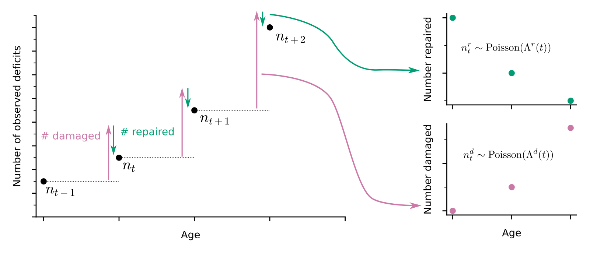

# Damage and repair processes in aging
Instead of simply measuring the health state as the count of binary health deficits as in a Frailty Index, we estimate damage and repair processes. Pre-print available at https://www.biorxiv.org/content/10.1101/2022.03.01.482443v1.

<p align="center"> 

</p>


# Documentation
A python package to extract counts of damaged and repaired binary health variables between longitudinal time-points (as in the above schematic) is available in damagerepair-counts/. It is installed with setup.py.

To use, provide input data as a pandas dataframe "data_raw", a list of deficits "deficits", and specify strings for individual id_column, time varaible time_column, and optiaonal death information.

```python

from damagerepair_counting import counting

data = counting(data_raw, deficits, id_column, time_column,
                deaths = None, death_column = None, status_column = None)

```

Joint models of survival and longitudinal repair and damage counts written in Stan are available in models/. For each of the datasets, these are fit by running fit_mouse_1.r, fit_mouse_2.r, and fit_mouse_3.r. A longitudinal model for human repair and damage counts is fit by running fit_human.r, which takes a command line argument for the chain ID.

Fitting the mouse models takes a few hours each (with all chains running parallel in time). Fitting the human data takes 12-15 hours using 40 CPU cores for a single chain. 

Bayesian spline models for interval censored survival data written in Stan are also available in models/. These are fit in plotting_code/mouse_timescales.r and plotting_code/human_timescales.r.

R Packages used:
```
R 4.1.0
abind 1.4-5
caret 6.0-92
cmdstanr 0.4.0
cowplot 1.1.1
dplyr 1.0.9
ggplot2 3.3.6
ggsci 2.9
ggfortify 0.4.14
gridExtra 2.3
glrt 2.0
latex2exp 0.9.4
pammtools 0.5.8
posterior 1.2.1
rstan 2.21.5
splines2 0.4.5
statmod 1.4.36
survival 3.2-11
survminer 0.4.9
tidybayes 3.0.2
tidyr 1.2.0
```

Stan version 2.26.0 was used.

python packages used
```
python 3.8.10
pyreadstat 1.1.0
pandas 1.4.2
numpy 1.22.4
matplotlib 3.5.2
```

# Datasets
Three different mice datasets are used, from https://doi.org/10.1093/gerona/gly219, https://doi.org/10.1093/gerona/glab297, and https://doi.org/10.1038/s41467-020-18446-0. Dataset 3 is freely available from https://github.com/SinclairLab/frailty. The authors of the other papers should be contacted to request access to mouse datasets 1 and 2.

Human data from the English Longitudinal Study of Aging are used, which can be accessed here https://www.elsa-project.ac.uk/accessing-elsa-data by registering. We use waves 1-9 from edition 31.

The code used to clean and pre-process these datasets is available in clean_datasets/.

# Demo
Running setup_demo.sh in demo/ will download and prepare mouse dataset 3 and save it in the datasets/ folder. The model for this dataset can then be fit by running fit_mouse_3.r. Fitting this model may take a couple hours.

# Citation
Please cite if this is useful

```
@article {Farrell2022,
	author = {Farrell, S and Kane, AE and Bisset, E and Howlett, SE and Rutenberg, AD},
	title = {Measurements of damage and repair in aging mice and humans reveals that robustness and resilience decrease with age, operate over broad timescales, and are affected differently by interventions},
	elocation-id = {2022.03.01.482443},
	year = {2022},
	doi = {10.1101/2022.03.01.482443},
	URL = {https://www.biorxiv.org/content/early/2022/03/03/2022.03.01.482443},
	eprint = {https://www.biorxiv.org/content/early/2022/03/03/2022.03.01.482443.full.pdf},
	journal = {bioRxiv}
}
```