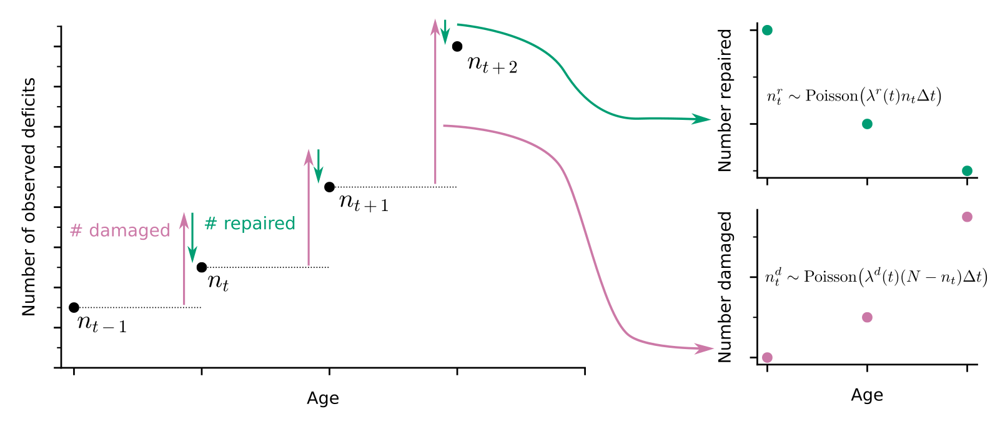

# Damage and repair processes in aging
Instead of simply measuring the health state as the count of binary health deficits as in a Frailty Index, we estimate damage and repair processes.

 

# Documentation
A python package to extract counts of damaged and repaired binary health variables between longitudinal time-points (as in the above schematic) is available in damagerepair-counts/.

Joint models of survival and longitudinal repair and damage counts written in Stan are available in models/. For each of the datasets, these are fit by running e.g. fit_mouse_1.r.

Bayesian spline models for interval censored survival data written in Stan are also available in models/. These are fit in plotting_code/mouse_timescales.r and plotting_code/human_timescales.r.

# Datasets
Three different mice datasets are used, from https://doi.org/10.1093/gerona/gly219, https://doi.org/10.1093/gerona/glab297, and https://doi.org/10.1038/s41467-020-18446-0. Dataset 3 is freely available from https://github.com/SinclairLab/frailty.

Human data from the English Longitudinal Study of Aging are used, which can be accessed here https://www.elsa-project.ac.uk/accessing-elsa-data by registering. We use waves 1-9.

The code used to clean and pre-process these datasets is available in clean_datasets/.

# Citation
Pre-print out soon.